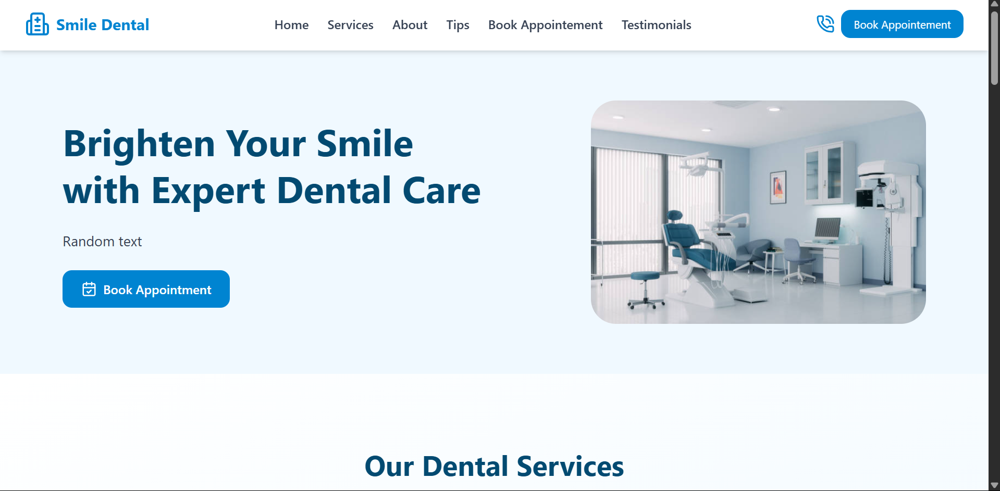
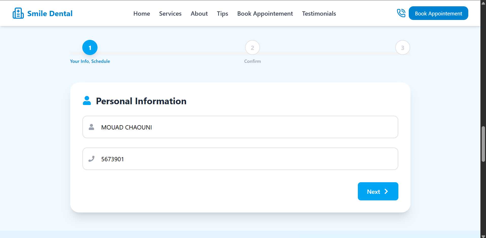
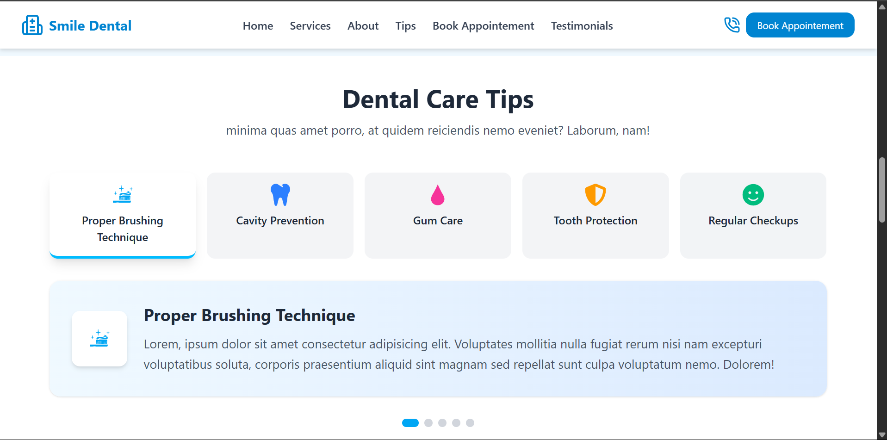
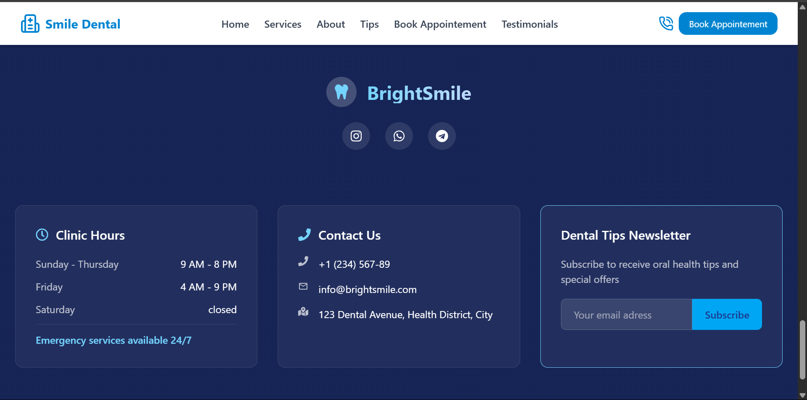

# 🦷 Dental Website

This is a simple, responsive dental clinic website built using **React** and **Tailwind CSS**. It was developed to practice modern frontend tools, component-based architecture, and styling with Tailwind.

## 📸 Preview

> The site includes sections such as:
- Header & Hero Section
- Services Offered
- About the Clinic
- Tips and Advice
- Book an Appointment Form
- Patient Testimonials
- Footer

---

## 🎥 Live Demo

Watch a short video of the website in action:

[![Watch the demo]]((https://youtu.be/G4Nqytm9gcA))

---

## 🚀 Technologies Used

- [React.js](https://reactjs.org/)
- [Tailwind CSS](https://tailwindcss.com/)
- [Vite](https://vitejs.dev/) – for fast React development
- JSX components architecture

## 🧱 Project Structure

```
src/
│
├── components/
│   ├── About.jsx
│   ├── BookAppointment.jsx
│   ├── Footer.jsx
│   ├── Header.jsx
│   ├── Hero.jsx
│   ├── Services.jsx
│   ├── Testimonials.jsx
│   └── Tips.jsx
│
├── App.jsx         # Main component rendering all sections
├── index.css       # Tailwind directives + custom CSS
└── main.jsx        # React entry point
```

## 🛠️ Setup & Installation

### 1. Clone the repo

```bash
git clone https://github.com/Mouad852/dental-landing-page.git
cd dental-landing-page
```

### 2. Install dependencies

```bash
npm install
```

### 3. Start the dev server

```bash
npm run dev
```

Your app should now be running at `http://localhost:5173`.

## 🧪 Learnings

This project helped reinforce:
- Using **Tailwind utility classes** for layout and design
- Creating **reusable components** in React
- Structuring a full single-page app with multiple sections
- Styling forms and layout with minimal custom CSS

## 🖼️ Screenshots








## 📦 Build

To create an optimized production build:

```bash
npm run build
```

---

## 📌 Future Improvements

- Add routing (e.g. React Router)
- Integrate real backend to process appointments
- Use Tailwind plugins for animations and transitions
- Improve responsiveness on smaller devices

---

## 👨‍💻 Author

- **CHAOUNI Mouad** - [@Mouad852](https://github.com/Mouad852)

---


